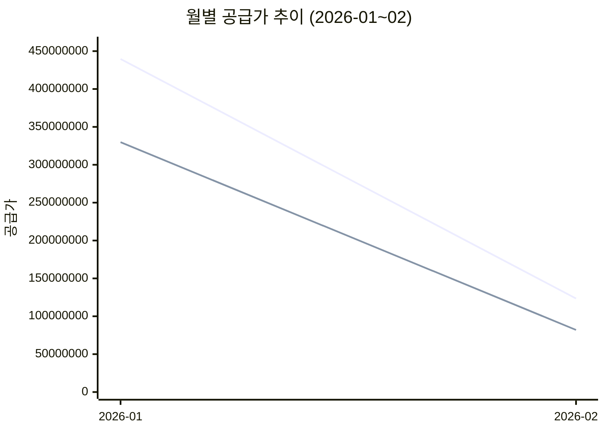
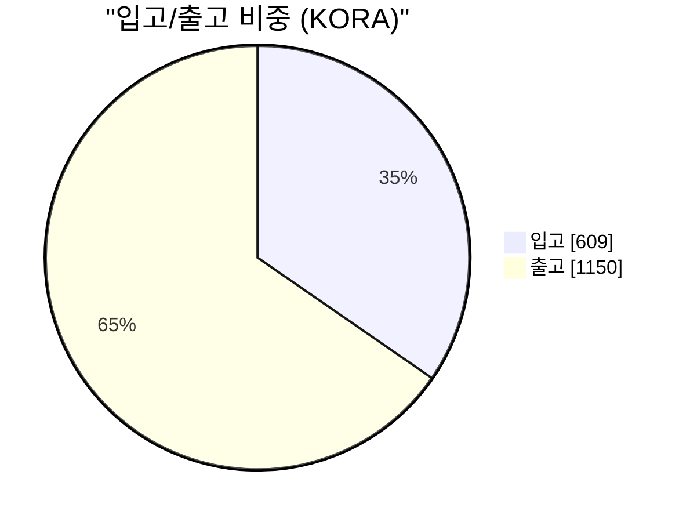
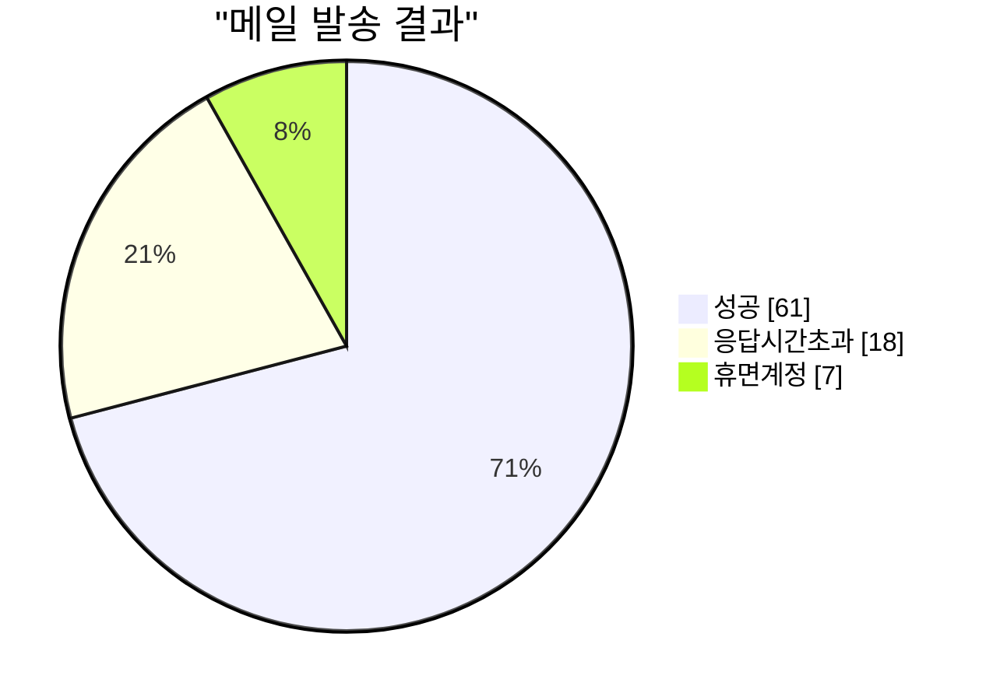

# 회사 운영/재정 분석 리포트 v1 (Excel 기반)

작성일: 2026-02-11  
분석 기준일: 2026-02-11  
데이터 소스: `src2/docs/excel` (KORA/Hometax/Extra)

> 주의: 본 문서는 **회계감사 보고서가 아닌 운영 분석 리포트**다.  
> 숫자는 원본 엑셀 기반 집계이며, 일부 컬럼 의미(특히 Extra)는 비확정 항목이 있어 `확실/비확실/추정`으로 분리했다.

---

## 1) Executive Summary

## 1.1 확실
- Hometax 기준 공급가액(매출): `563,200,065`
- Hometax 기준 공급가액(매입): `411,769,053`
- 공급가 기준 매출총이익(단순): `151,431,012`
- 공급가 기준 매출총이익률(단순): `26.9%`
- KORA 계량 건수: `1,774건`, 순중량 합계: `59,465,760`
- 계량 핵심 누락(총중량/공차/slip): `15건` (약 `0.85%`)
- 거래처 코드 교차중복(대구/성주): `106/232` (`45.7%`)

## 1.2 비확실
- Extra의 `부가세합` 컬럼 의미(세전/세후/합계)는 문서만으로 확정 불가
- Hometax 거래처 집중도는 상호 표기 변형(예: 달구벌산업 표기 다양)으로 왜곡 가능

## 1.3 추정
- 운영상 핵심 병목은 생산/물류가 아니라 **마스터데이터 표준화(거래처/품목명/비고)** 쪽이다.
- 분류체계+중복큐만 안정화하면 자동화 효율이 크게 오를 가능성이 높다.

---

## 2) 재무 스냅샷 (Hometax 중심)

## 2.1 손익 관점(공급가 기준 단순)
- 매출 공급가액: `563,200,065`
- 매입 공급가액: `411,769,053`
- 매출총이익(단순): `151,431,012`
- 매출총이익률(단순): `26.9%`

계산식:
- `매출총이익 = 매출 공급가 - 매입 공급가`
- `매출총이익률 = 매출총이익 / 매출 공급가`

## 2.2 사이트별 수익성(단순)
- 대구:
  - 매출 공급가: `304,514,112`
  - 매입 공급가: `215,118,838`
  - 총이익(단순): `89,395,274`
  - 총이익률(단순): `29.4%`
- 성주:
  - 매출 공급가: `258,685,953`
  - 매입 공급가: `196,650,215`
  - 총이익(단순): `62,035,738`
  - 총이익률(단순): `24.0%`

```mermaid
xychart-beta
  title "사이트별 매출/매입 공급가 (원)"
  x-axis [대구, 성주]
  y-axis "공급가" 0 --> 320000000
  bar [304514112, 258685953]
  bar [215118838, 196650215]
```

## 2.3 월별(관측 기간) 매출/매입 공급가
- 2026-01:
  - 매출: `439,692,635`
  - 매입: `329,792,698`
  - 차이: `109,899,937`
- 2026-02:
  - 매출: `123,507,430`
  - 매입: `81,976,355`
  - 차이: `41,531,075`



## 2.4 세무/납부 흐름
- 납부내역 합계: `231,995,860` (총 28건)
- 세목 건수:
  - 부가가치세 12
  - 근로소득세(갑) 7
  - 사업소득세 4
  - 퇴직소득세 3
  - 법인세 2

---

## 3) 운영 스냅샷 (KORA + Hometax 메일)

## 3.1 계량 운영 상태
- 총 계량: `1,774건`
- 입고: `609` / 출고: `1,150` (공란 제외 시 출고 비중 약 `65.4%`)
- 순중량 합계: `59,465,760`
- 누락 데이터(총중량/공차/slip): 각 `15건`



## 3.2 품목/거래처 집중
- KORA 중량 상위 품목은 PP/PE 계열 집중
- KORA 중량 상위 거래처에서 `에코로지스(주)칠곡지점` 비중이 높음

운영상 의미(추정):
- 특정 거래처/품목 집중도가 높아 단가 변동이나 거래 중단 시 변동성 리스크가 큼

## 3.3 전자세금계산서 메일 성공률
- 대구 메일현황 총 `86건`
- 성공 `61`, 실패 `25`
- 실패율: `29.1%`
  - 응답시간 초과: 18
  - 휴면계정: 7



---

## 4) 문제점 진단

## 4.1 확실한 문제
1. 거래처 마스터 중복
- 교차 사이트 중복 코드 비율이 높음(`45.7%`)  
- 동일 엔티티가 중복 저장되어 조회/정산 혼선 가능

2. 계량 예외 데이터 존재
- 총중량/공차/slip 누락 15건  
- 후속 정산/세금계산서 매칭에서 누락 또는 오매칭 유발

3. 품목/비고 표기 비정형
- 같은 의미가 여러 표현으로 존재(운송비/운임/운반비 등)
- 자동 분류 정확도 저하

4. 메일 실패율 높음
- 대구 기준 29.1% 실패
- 전자세금계산서 전달 품질 리스크

## 4.2 비확실/검증 필요
1. Extra의 금액 컬럼 정의
- `금액`, `부가세합`이 어떤 회계 의미인지 확정 필요

2. Hometax 거래처명 정규화
- 달구벌산업 표기가 여러 변형으로 집계되어 집중도 왜곡 가능

3. KORA 금액 컬럼 신뢰도
- 일부 집계에서 비정상적으로 작게 잡히는 케이스 존재(컬럼 의미/형식 재검증 필요)

## 4.3 추정 리스크
- 현재 상태로 서버 이관하면, 데이터 정합 이슈가 API/DB 설계로 전이될 가능성 큼
- 먼저 분류/중복/예외 정책을 고정하는 것이 전체 비용을 줄일 확률이 높음

---

## 5) 운영등급(현재판)

## 5.1 재무 데이터 준비도: `B-`
- 이유: 매입/매출 핵심 수치는 충분히 수집 가능
- 감점: Extra 컬럼 정의 불명, 명칭 표준 미완료

## 5.2 운영 데이터 품질: `C+`
- 이유: 계량/거래처/세금계산서가 연결 가능 구조
- 감점: 중복 마스터, 누락 필드, 비정형 텍스트

## 5.3 자동화 준비도: `B`
- 이유: 규칙 기반 반자동 분류로 빠르게 개선 가능
- 조건: duplicateQueue + exceptionQueue + rule dictionary 고정 필요

---

## 6) 경영/운영 관점 권고 (우선순위)

## 6.1 2주 내
1. 거래처 표준키 정책 확정 (`site + partnerCode` + 통합ID)
2. 계량 예외 15건 처리 루틴 고정
3. 품목/비고 정규화 사전 v1 확정
4. 메일 실패 재발송/주소정비 프로세스 운영

## 6.2 4주 내
1. 매입/매출/계량 매칭 대시보드(일자/사이트/거래처/품목)
2. 월별 손익 추정 리포트 자동생성
3. 예외큐 처리 SLA(예: D+1까지 처리) 도입

## 6.3 Phase 6 전 필수
1. 분류 규칙(rule dictionary) 버전관리
2. 중복 병합 이력/롤백 가능 구조
3. 사이트별 마스터 소유권(정본 우선순위) 결정

---

## 7) 부록: 핵심 수치표

| 지표 | 값 |
|---|---:|
| Hometax 매출 공급가 | 563,200,065 |
| Hometax 매입 공급가 | 411,769,053 |
| 단순 매출총이익 | 151,431,012 |
| 단순 매출총이익률 | 26.9% |
| KORA 계량 건수 | 1,774 |
| KORA 순중량 합계 | 59,465,760 |
| 계량 핵심 누락 건수 | 15 |
| 거래처 코드 유니크 | 232 |
| 교차 사이트 중복 코드 | 106 |
| 납부내역 합계 | 231,995,860 |
| 대구 메일 실패율 | 29.1% |

---

## 8) 판정 요약
- 이 회사 데이터는 이미 “운영 진단/손익 스냅샷”을 낼 수 있는 수준이다. (확실)
- 하지만 회계/경영 의사결정에 바로 쓰려면 표준화와 정합 검증이 먼저다. (확실)
- 지금 최적 전략은 “완전 자동화”가 아니라 “반자동 검토 + 규칙 고정”이다. (추정)
